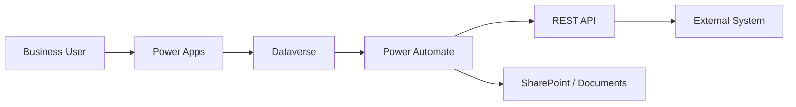

# Integration Architecture

## Designing reliable integration ecosystems

I design integration strategies based on context, constraints and long-term sustainability.

## Integration patterns

- API-first architecture
- Event-driven integration
- Batch processing workflows
- Document-based integrations

## Technologies

- Power Automate orchestration
- Azure Integration Services
- REST APIs
- Dataverse
- SharePoint and document management

## Key considerations

- Performance and scalability
- Data consistency
- Security and access control
- Reliability and fault tolerance

## Example integration flow

